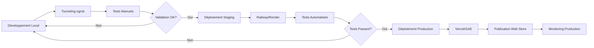

## 9. PIPELINES ET WORKFLOWS {#9-pipelines}

### 9.1 Pipeline Développement → Production

```mermaid
graph LR
    A[Développement Local] --> B[Tunneling ngrok]
    B --> C[Tests Manuels]
    C --> D{Validation OK?}
    D -->|Non| A
    D -->|Oui| E[Déploiement Staging]
    E --> F[Railway/Render]
    F --> G[Tests Automatisés]
    G --> H{Tests Passent?}
    H -->|Non| A
    H -->|Oui| I[Déploiement Production]
    I --> J[Vercel/GAE]
    J --> K[Publication Web Store]
    K --> L[Monitoring Production]
```
